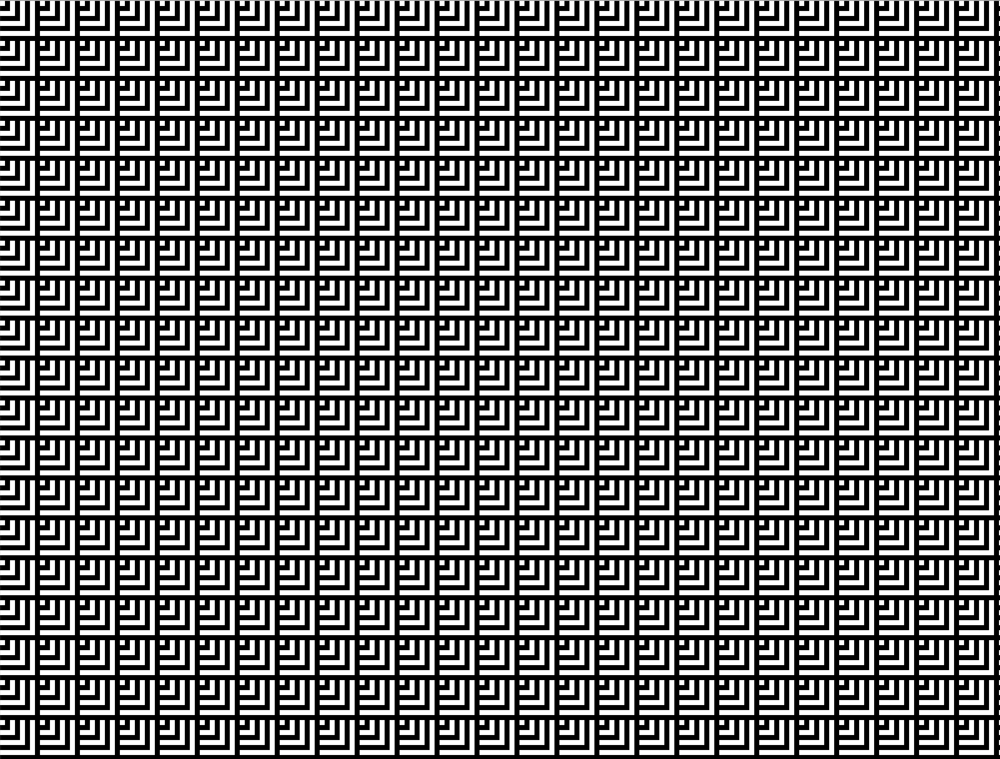
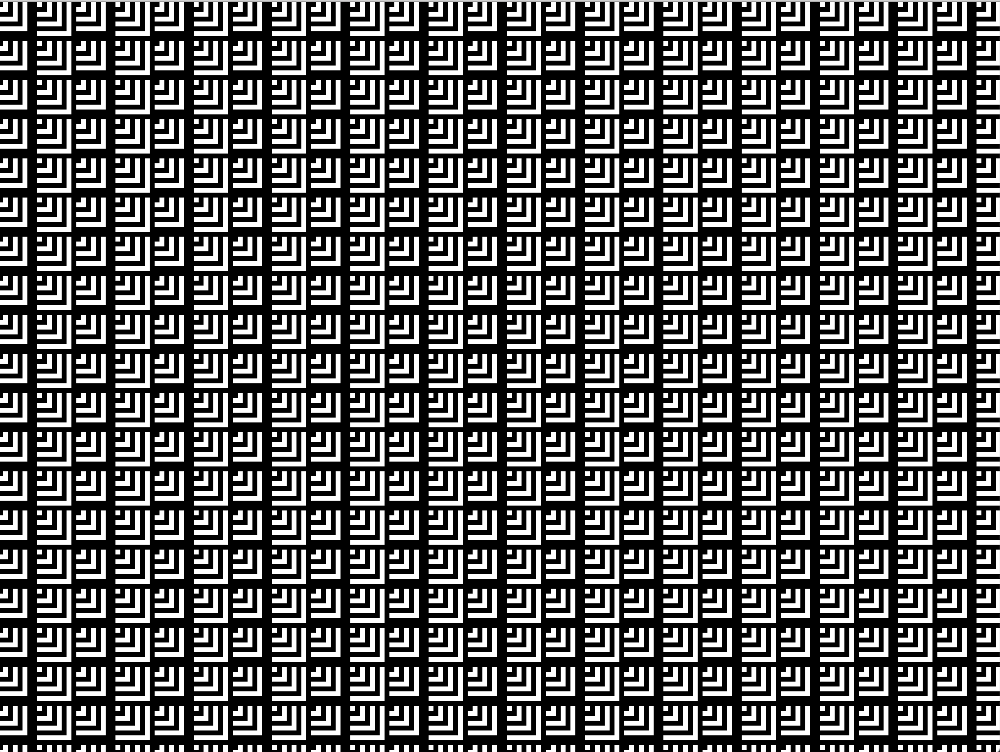
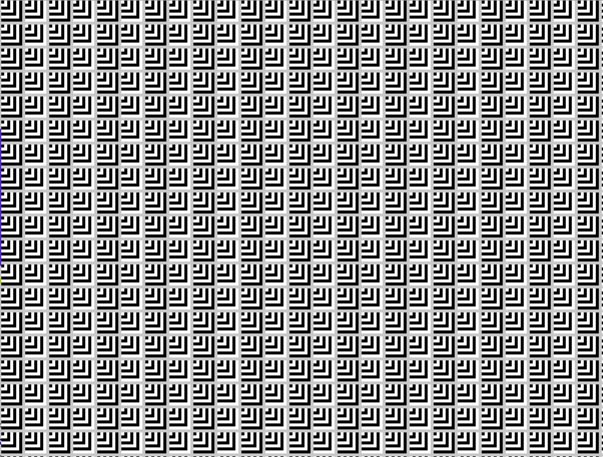
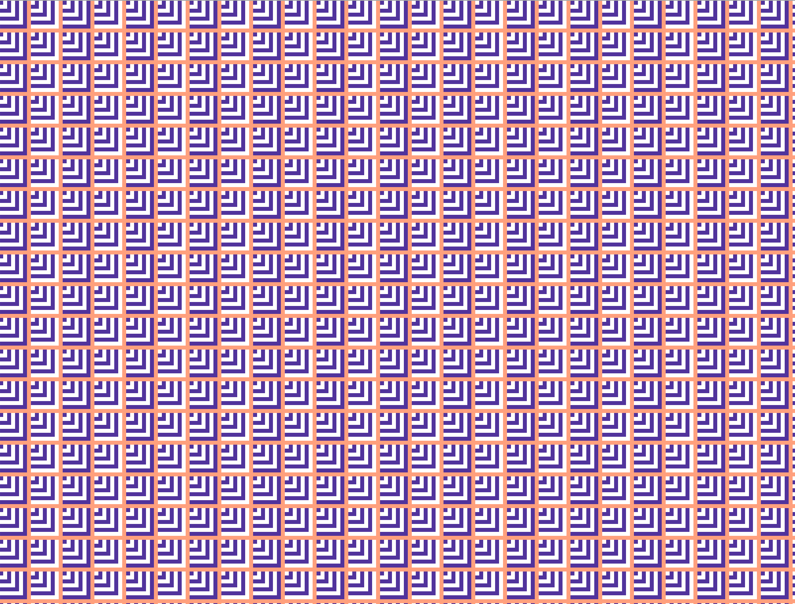

## Genuary

Using _OpenFrameworks_ for a month.

Challenges from:

https://genuary2021.github.io

GENUARY is an artificially generated month of time where we build code that makes beautiful things.

It happens during the month of January 2021.

For every 24 hour day within this 744 hour timespan, we have prepared a prompt with instructions for you to execute.

You don’t have to follow the prompt exactly. Or even at all. But, y’know, we put effort into this.

You can use any language, framework or medium. Please respect the Geneva Conventions.

I'll upload my daily challenges here:

## 1st of January

// TRIPLE NESTED LOOP

The first two nested loops create a grid & the third draws a series of squares that start from the same point (x,y) with incremental size within every point in the grid. Additionally, every square alternates colors to create an illusion of depth.

_Baseline colors: B/W_

_ Baseline colors: B/W + Black background _

_ Baseline colors: B/W + Gray background _

_ Custom colors: Purple & White + Salmon background _

