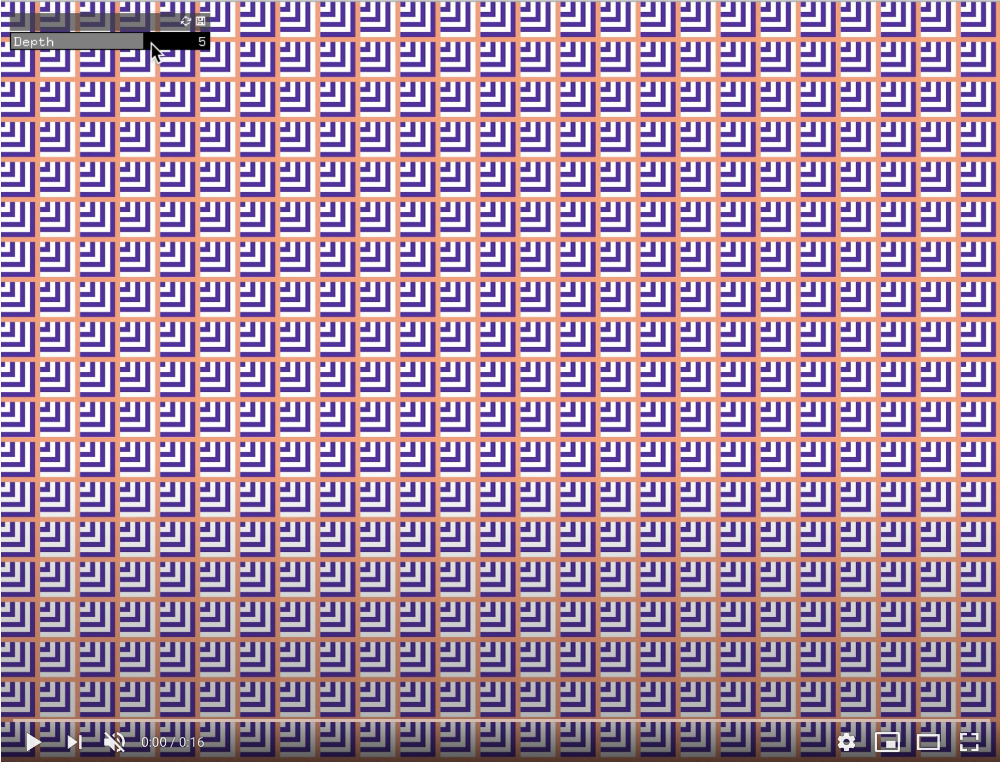

## Genuary

Using _OpenFrameworks_ for a month.

Challenges from:

https://genuary2021.github.io

GENUARY is an artificially generated month of time where we build code that makes beautiful things.

It happens during the month of January 2021.

For every 24 hour day within this 744 hour timespan, we have prepared a prompt with instructions for you to execute.

You don’t have to follow the prompt exactly. Or even at all. But, y’know, we put effort into this.

You can use any language, framework or medium. Please respect the Geneva Conventions.

I'll upload my daily challenges here:

## 1st of January

// TRIPLE NESTED LOOP

The first two nested loops create a grid & the third draws a series of squares that start from the same point (x,y) with incremental size within every point in the grid. Additionally, every square alternates colors to create an illusion of depth.

_Baseline colors: B/W_

_Baseline colors: B/W + Black background_

_Baseline colors: B/W + Gray background_

_Custom colors: Purple & White + Salmon background_

_Inveractive version: Move slider to change the depth of the squares (Youtube)_

## 2nd of January

// Rule 30 (elementary cellular automaton)

https://www.wolframalpha.com/input/?i=rule+30

Important reference about Cellular Automaton --> The Nature of Code | Daniel Shiffman
https://www.youtube.com/watch?app=desktop&v=W1zKu3fDQR8

_First Generations_

_Inveractive version: Move slider to change the starting Index of the first row of the cellular automaton (Youtube)_

_30 cells Cellular Automaton using Rule 30 and an slider_

_Inveractive version: Move slider to change the starting Index of the first row of the cellular automaton (Youtube)_

